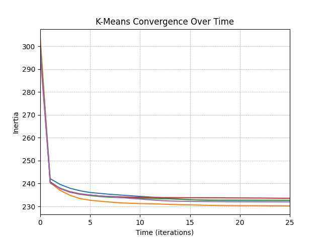
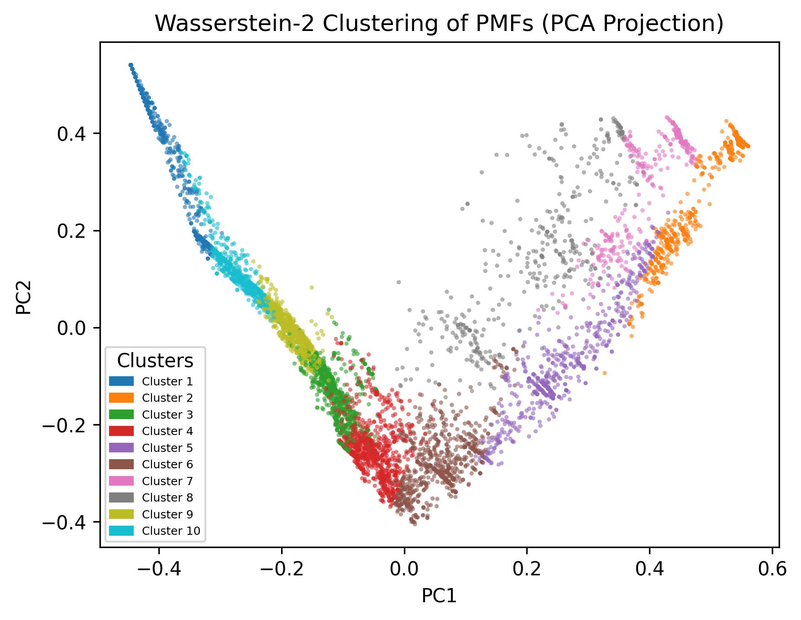
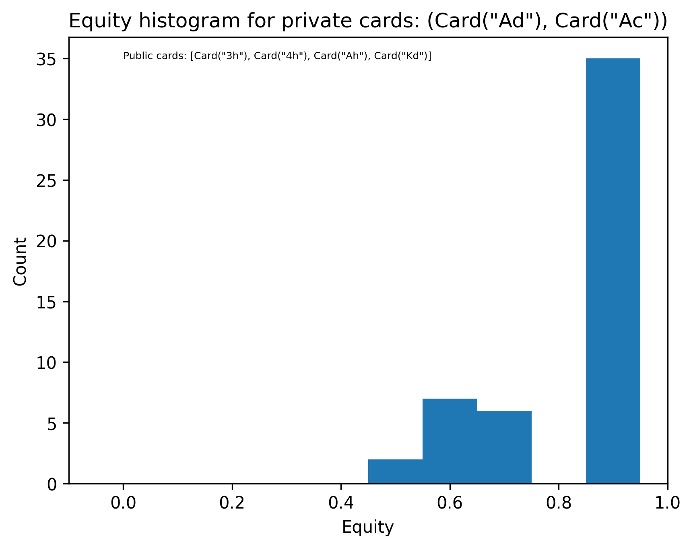
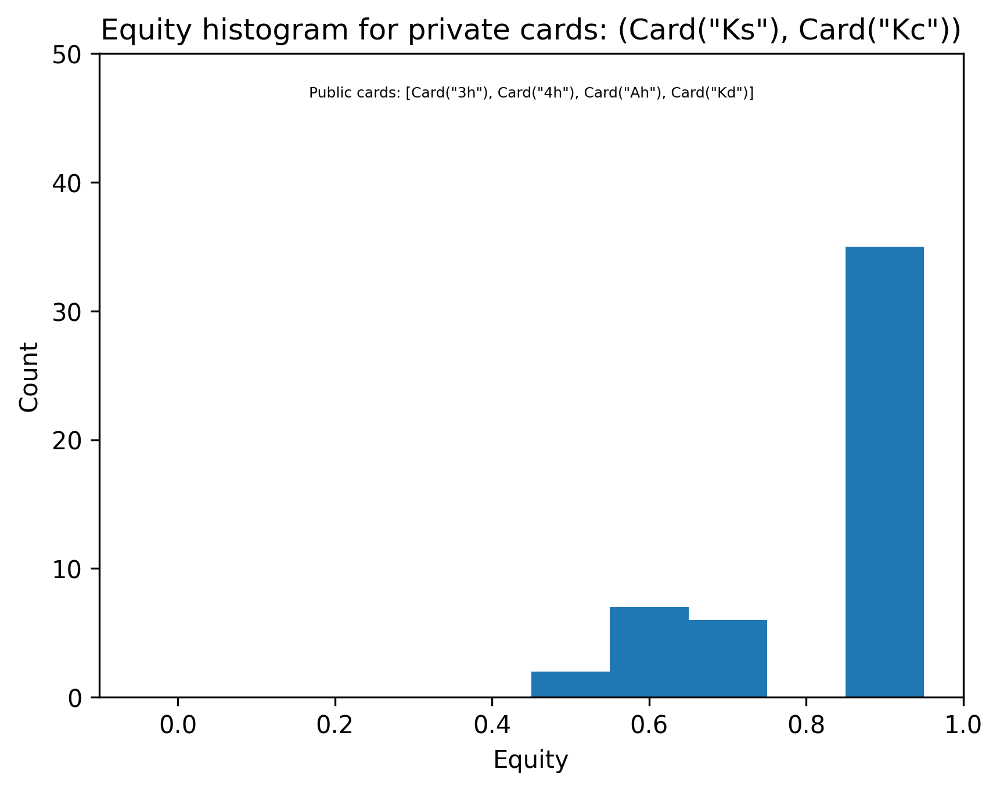
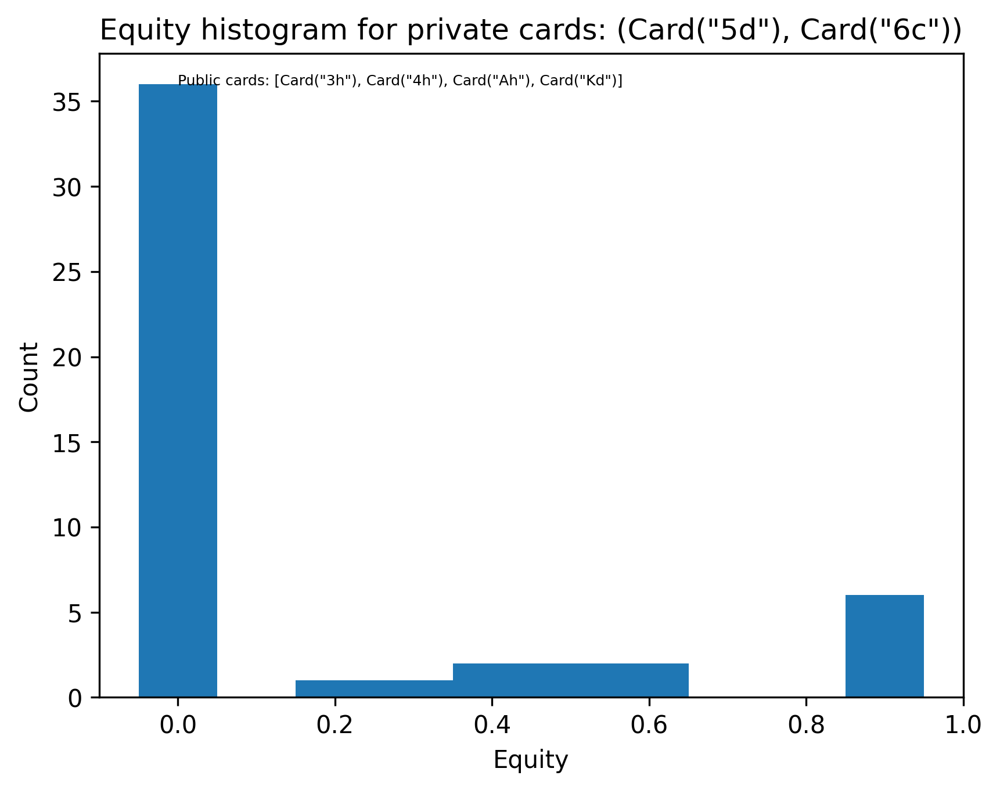
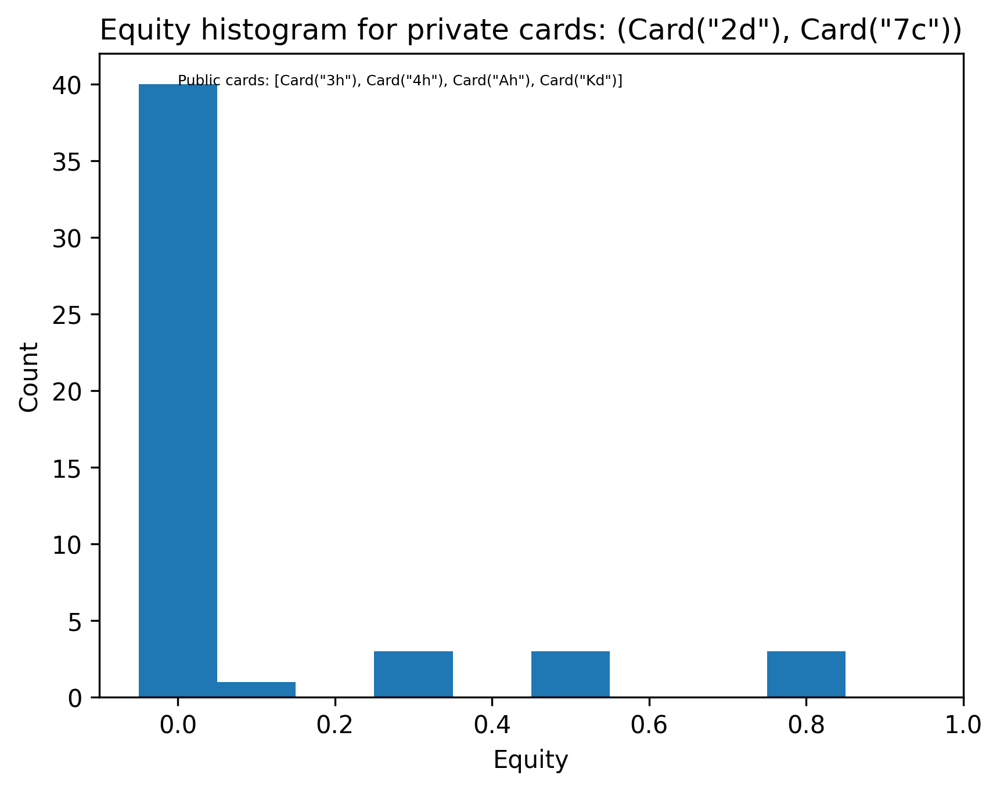
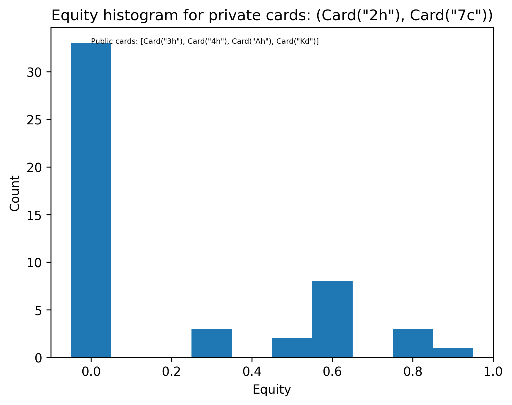
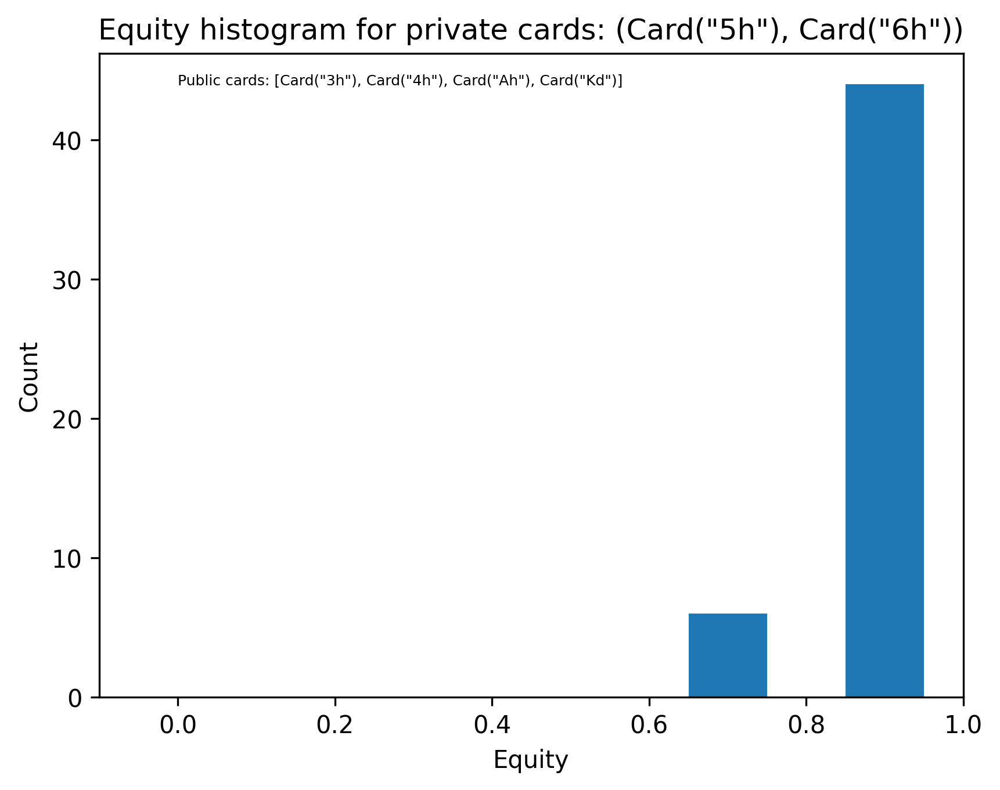

# Results

In this text we will go over how to run tests and how we verified the algorithm was working as intended. We will also go over 
some issues and areas of improvements.

To run all of the tests, from the root directory run:

```
./build/tests
```
You should see an output like:

```terminal
Randomness seeded to: 2932034044
Warning: objective increased at iteration 23 old: 232.681 new: 232.682
File 1 - first objective: 301.165 last objective: 232.682
File 2 - first objective: 299.069 last objective: 231.907
File 3 - first objective: 296.502 last objective: 233.5
File 4 - first objective: 303.912 last objective: 230.132
File 5 - first objective: 300.903 last objective: 232.585
Saved convergence data to ../tests/inertia_metrics/convergence_data_file_1.csv
Saved convergence data to ../tests/inertia_metrics/convergence_data_file_2.csv
Saved convergence data to ../tests/inertia_metrics/convergence_data_file_3.csv
Saved convergence data to ../tests/inertia_metrics/convergence_data_file_4.csv
Saved convergence data to ../tests/inertia_metrics/convergence_data_file_5.csv
===============================================================================
```

This text won't go over all test cases, but each file has a special tag if you want to run those tests independently. To do this
follow the information in the table.


To show this algorithm is doing as intended, we need to show that for each iteration of our algorithm, the objective 
decreases until convergence. The second test we need to show is that the resultant percent point functions generated 
from our algorithms are in fact valid probability mass functions.

To show that our algorithm is in fact converging to a local minimum, we present the `test_get_objective` inside the 
`test_wkmeans_metrics.cpp` file. This test runs the algorithm for 200 steps on 5 test files that each have 6000 sample points.



This graph demonstrates each one of the 5 samples converging over 35 iterations with 100 clusters. To view these graphs,
after building the project, run:
```
cd scripts
python3 -m venv .venv
pip3 install -r requirements.txt
python3 generate_metrics_graphs.py
```
A folder called graphs should appear with this graph inside.

After converging, we can run tests to determine whether the pdfs generated from our algorithm are valid. To do this, 
run:
```
./tests "run_procedure_tests"
```
In these tests we run our run procedure:
```c++
WKmeans<double> test_wkmeans(pdfs.size(), N_CLUSTERS, EPSILON, pdfs, cdfs, ppfs, 10, 42);
    test_wkmeans.init_clusters();
    test_wkmeans.init_bounds();
    for(int t = 0; t < 50; t++){
        test_wkmeans.update_clusters();
        test_wkmeans.update_bounds();
        test_wkmeans.swap_clusters();
        for(int k = 0; k < N_CLUSTERS; k++){
            REQUIRE(valid_cluster(test_wkmeans.clusters[k]));
        }
        test_wkmeans.assign_new_clusters();
    }
```
and each iteration we make sure the clusters computed are monotonic and positive.
After 50 iterations, the algorithm given the dataset should converge. After convergence, we check if the generated clusters, once
converted back to pdfs are valid.
```c++
std::vector<PDF<double>> temp_pdfs = test_wkmeans.convert_clusters();
for(int k = 0; k < N_CLUSTERS; k++){
    REQUIRE(is_valid_pdf(temp_pdfs[k]));
}
```

We can utilize PCA
to perform qualitative tests on our clusters. Inside the `./tests/test_files` we use `test_input_1.txt`. We run our kmeans 
algorithm to get 10 clusters on 6000 data points. We then assign the data points to the 10 clusters, and use PCA to reduce
the data to 2 dimensions. Our 2 principal components retained 40% of our data's variance. Plotting our data points,
and assigning a color to the clusters they belong to, we are presented with this graph:



Cluster separation in the projected space suggests that the learned structure is partially captured in a low-dimensional 
Euclidean embedding, despite clustering being performed in Wasserstein space.

This graph was generated from the `generate_metrics_graphs.py` script, with function `pca_graphs()`.

To evaluate whether our clusters are meaningful, we perform qualitative analysis on the clustered data. The dataset consists 
of equity histograms derived from poker turn game states. An equity histogram represents the distribution of river equities 
by counting the frequency of each possible river outcome given a specific turn scenario. In this setting, for each turn state, 
we record the number of occurrences corresponding to each resulting river equity.

These clusters were generated using the turn board 3h, 4h, Ah, Kd. We then computed the corresponding equity distributions 
for the following hands: Ad Ac, Ks Kc, 5d 6c, 2d 7c, 2h 7c, and 5h 6h.

The equity distributions for each of the private cards can be seen below:
# Conclusions

The purpose of this code was to create a fast, parallelizable method for clustering probability mass functions. The data 
used to verify these tests were equity histograms of poker turn scenarios. Each histogram represents a probability distribution 
over possible outcomes, making them well-suited for comparison using Wasserstein distance rather than standard Euclidean metrics.

Further work to validate and interpret the resulting clusters involves mapping each data point back to its corresponding 
poker turn scenario and analyzing whether the clusters align with meaningful game states, such as board texture, equity 
distribution shape, or strategic similarity. This would help determine whether the clustering is not only mathematically 
coherent but also practically useful for understanding structure in poker decision-making spaces.
<table>
  <tr>
    <td></td>
    <td></td>
    <td></td>
  </tr>
  <tr>
    <td></td>
    <td></td>
    <td></td>
  </tr>
</table>


